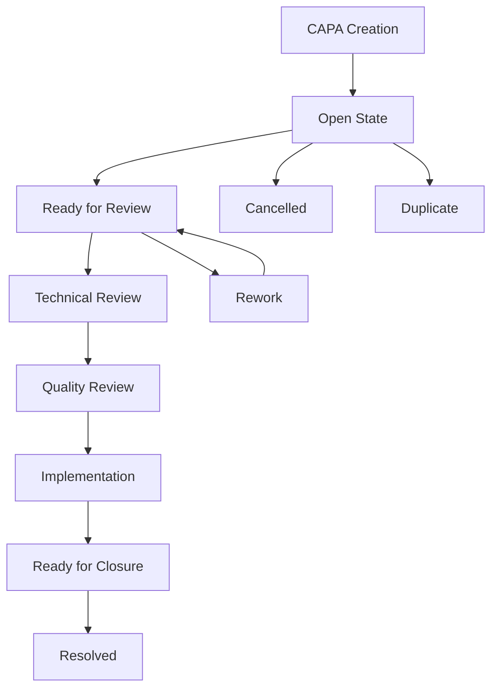

# CAPA Workflow Guide

## Overview
This document outlines the step-by-step workflow of the CAPA process, from initiation to closure.

## Workflow Summary

## Detailed Workflow Steps

### 1. CAPA Creation
**Actions**:
- Review incident details
- Evaluate CAPA necessity
- Consider stakeholder input

**Outputs**:
- CAPA is opened
- Initial documentation created
- Team assigned

**Next Steps**:
- Move to Open state
- Cancel if not needed

### 2. Open State
**Actions**:
- Team authors CAPA
- Create Break Fix items
- Define Action Items
- Document investigation

**Outputs**:
- Complete documentation
- Action plan defined
- Evidence collected

**Next Steps**:
- Ready for Review
- Cancel if duplicate

### 3. Ready for Review
**Actions**:
- Quality Reviewer performs initial audit
- Technical Assessor reviews content
- Prepare for group review

**Outputs**:
- Review feedback
- Required changes identified
- Quality assessment

**Next Steps**:
- Technical Review
- Rework if needed

### 4. Technical Review
**Actions**:
- Validate technical approach
- Assess solution design
- Review implementation plan
- Evaluate risks

**Outputs**:
- Technical approval
- Risk assessment
- Implementation guidance

**Next Steps**:
- Quality Review
- Rework if needed

### 5. Quality Review
**Actions**:
- Review within 36 hours
- Assess documentation quality
- Verify completeness
- Check standards

**Outputs**:
- Quality approval
- Final documentation
- Process validation

**Next Steps**:
- Implementation
- Rework if needed

### 6. Implementation
**Actions**:
- Execute Break Fix items
- Complete Action Items
- Document progress
- Verify effectiveness

**Outputs**:
- Implemented solutions
- Evidence collected
- Verification results

**Next Steps**:
- Ready for Closure
- Rework if ineffective

### 7. Ready for Closure
**Actions**:
- Verify all actions complete
- Final documentation review
- Effectiveness check
- Stakeholder review

**Outputs**:
- Completion evidence
- Final approval
- Learning capture

**Next Steps**:
- Resolved
- Rework if incomplete

### 8. Resolved State
**Actions**:
- Share lessons learned
- Monitor long-term actions
- Document final status
- Archive documentation

**Outputs**:
- Completed CAPA
- Documented learnings
- Process improvements

## Timeline Requirements

### Standard SLAs
1. CAPA Creation to Ready for Review: 7 days
2. Break Fix Items: 14 days from creation
3. Action Items: 60 days from creation
4. Quality Review: 36 hours after submission
5. Long Term Items: Target date required

## Best Practices

### Documentation
- Complete all sections thoroughly
- Include supporting evidence
- Link related items
- Maintain clear status updates

### Review Process
- Technical review before group review
- Quality review after group consensus
- Regular progress monitoring
- Clear communication of changes

### Implementation
- Track all action items
- Regular status updates
- Document completion evidence
- Verify effectiveness

## Next Steps
- Review [Templates](../guides/templates/)
- Check [Best Practices](../training/best-practices.md)
- Start [Implementation](../guides/templates/initiation.md)
